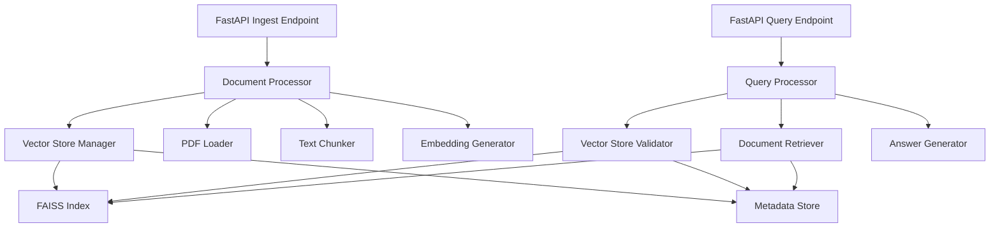

# Design Document: RAG Ingestion Pipeline

## Overview

This design addresses critical issues in the RAG Document Intelligence system's ingestion pipeline. The current implementation has several problems:

1. **Incomplete vector store cleanup** - Files are deleted but directory state isn't validated
2. **Missing error handling** - No validation of vector store creation success
3. **Race conditions** - No atomic operations for file management
4. **Inconsistent state detection** - Query API doesn't properly detect empty/corrupted indexes
5. **Poor error messaging** - Generic responses don't distinguish between different failure modes

The redesigned system will provide robust single-document RAG functionality with reliable ingestion, proper error handling, and clear user feedback.

## Architecture

The system follows a layered architecture with clear separation of concerns:



## Components and Interfaces

### 1. Vector Store Manager

**Purpose**: Centralized management of FAISS index and metadata with atomic operations.

**Interface**:
```python
class VectorStoreManager:
    def initialize_clean_store(self) -> bool
    def store_embeddings(self, embeddings: np.ndarray, chunks: List[Dict]) -> bool
    def validate_store_integrity(self) -> Tuple[bool, str]
    def get_store_status(self) -> Dict[str, Any]
```

**Key Features**:
- Atomic file operations using temporary files and atomic moves
- Comprehensive validation of FAISS index and metadata consistency
- Safe cleanup of existing files before new ingestion
- Detailed status reporting for debugging

### 2. Document Processor

**Purpose**: Orchestrates the complete ingestion pipeline with comprehensive error handling.

**Interface**:
```python
class DocumentProcessor:
    def process_document(self, file_path: str, filename: str) -> ProcessingResult
    def validate_pdf_content(self, text: str) -> Tuple[bool, str]
```

**Processing Flow**:
1. Initialize clean vector store
2. Extract and validate PDF text
3. Generate and validate chunks
4. Create and validate embeddings
5. Store with integrity verification
6. Return detailed processing results

### 3. Vector Store Validator

**Purpose**: Validates vector store state before query processing.

**Interface**:
```python
class VectorStoreValidator:
    def validate_for_query(self) -> ValidationResult
    def get_index_stats(self) -> Dict[str, Any]
```

**Validation Checks**:
- Files exist and are readable
- FAISS index is valid and non-empty
- Metadata file is valid and matches index size
- Embedding dimensions are consistent

### 4. Enhanced Query Processor

**Purpose**: Provides intelligent query handling with proper error detection.

**Interface**:
```python
class QueryProcessor:
    def process_query(self, query: str) -> QueryResult
    def get_system_status(self) -> Dict[str, Any]
```

**Query Flow**:
1. Validate vector store state
2. Return appropriate error if invalid
3. Perform retrieval if valid
4. Generate contextual responses

## Data Models

### ProcessingResult
```python
@dataclass
class ProcessingResult:
    success: bool
    message: str
    chunks_created: int
    document_name: str
    error_details: Optional[str] = None
    processing_stats: Optional[Dict] = None
```

### ValidationResult
```python
@dataclass
class ValidationResult:
    is_valid: bool
    error_type: str  # "no_document", "corrupted_index", "missing_files", "valid"
    error_message: str
    index_size: int = 0
    metadata_count: int = 0
```

### QueryResult
```python
@dataclass
class QueryResult:
    answer: str
    citations: List[Dict]
    status: str  # "success", "no_document", "no_relevant_content", "error"
    error_details: Optional[str] = None
```

## Correctness Properties

*A property is a characteristic or behavior that should hold true across all valid executions of a system-essentially, a formal statement about what the system should do. Properties serve as the bridge between human-readable specifications and machine-verifiable correctness guarantees.*

Now I'll analyze the acceptance criteria to determine which ones can be tested as properties:

Based on the prework analysis and property reflection, here are the key correctness properties:

### Property 1: Document Replacement Consistency
*For any* sequence of document uploads, when a new document is uploaded, the vector store should contain only embeddings from the most recent document, and all queries should return results exclusively from that document.
**Validates: Requirements 1.1, 1.3, 1.4, 8.2, 8.3**

### Property 2: Vector Store Initialization
*For any* ingestion process, when the process begins, all required directories should be created if missing, and the vector store should be completely reinitialized before processing.
**Validates: Requirements 1.2, 1.5, 2.1**

### Property 3: Vector Store Integrity
*For any* completed ingestion, the FAISS index size should equal the metadata count, both files should exist and be non-empty, and all metadata entries should contain required fields (text, source, page).
**Validates: Requirements 2.2, 2.5, 4.2, 4.4, 4.5**

### Property 4: Atomic File Operations
*For any* vector store write operation, either both index.faiss and metadata.pkl are successfully created, or neither exists (no partial state).
**Validates: Requirements 7.2**

### Property 5: Text Processing Pipeline
*For any* valid PDF with extractable text, the pipeline should produce chunks with appropriate overlap, generate embeddings with correct dimensions, and validate each step before proceeding.
**Validates: Requirements 3.1, 3.2, 3.3, 3.5, 4.1**

### Property 6: Error State Detection
*For any* query attempt, the system should correctly identify and communicate whether the issue is "no document loaded", "corrupted index", "no relevant content found", or successful retrieval.
**Validates: Requirements 5.1, 5.2, 5.4, 5.5, 8.5**

### Property 7: Error Handling and Recovery
*For any* failure during ingestion (PDF upload, text extraction, embedding generation, or vector store saving), the system should clean up partial state, return specific error details, and not leave the system in an inconsistent state.
**Validates: Requirements 2.3, 3.4, 6.1, 6.2, 6.3, 6.4**

### Property 8: File System Safety
*For any* file system operation (directory creation, file writing, file deletion), the system should handle existing files gracefully, use safe operations, and validate results.
**Validates: Requirements 2.4, 7.1, 7.3, 7.5**

### Property 9: Single Document Session
*For any* system state, there should be at most one active document, and the system should clearly communicate which document (if any) is currently active.
**Validates: Requirements 8.1, 8.4**

## Error Handling

### Error Categories

1. **Upload Errors**
   - File format validation
   - File size limits
   - Disk space availability

2. **Processing Errors**
   - PDF corruption or encryption
   - Text extraction failures
   - Empty or insufficient content

3. **Vector Store Errors**
   - Directory creation failures
   - File permission issues
   - FAISS index corruption
   - Metadata inconsistencies

4. **Query Errors**
   - Missing vector store
   - Corrupted index files
   - Embedding dimension mismatches

### Error Response Format

```python
@dataclass
class ErrorResponse:
    error_type: str  # "upload_error", "processing_error", "vector_store_error", "query_error"
    message: str     # User-friendly message
    details: str     # Technical details for debugging
    suggestions: List[str]  # Actionable suggestions for user
```

### Recovery Strategies

1. **Graceful Degradation**: System continues to function with clear error messages
2. **Automatic Cleanup**: Failed operations clean up partial state
3. **Retry Logic**: Transient failures are retried with exponential backoff
4. **State Validation**: System validates state before critical operations

## Testing Strategy

### Dual Testing Approach

The system will use both unit tests and property-based tests for comprehensive coverage:

**Unit Tests** focus on:
- Specific examples of successful ingestion flows
- Edge cases like empty PDFs, corrupted files, permission errors
- Integration points between components
- Error message accuracy and formatting

**Property-Based Tests** focus on:
- Universal properties that hold across all valid inputs
- Comprehensive input coverage through randomization
- Invariants that must be maintained regardless of input
- State consistency across operations

### Property-Based Testing Configuration

- **Framework**: Hypothesis for Python
- **Iterations**: Minimum 100 iterations per property test
- **Test Tagging**: Each test references its design document property
- **Tag Format**: `# Feature: rag-ingestion-pipeline, Property {number}: {property_text}`

### Test Data Generation

**PDF Generation Strategy**:
- Generate PDFs with varying text content lengths
- Include edge cases: empty PDFs, image-only PDFs, encrypted PDFs
- Test with different file sizes and structures

**Text Generation Strategy**:
- Generate text of varying lengths (empty, short, medium, long)
- Include special characters, Unicode, and formatting
- Test chunking behavior with different content types

**Vector Store State Generation**:
- Generate various vector store states (empty, corrupted, partial)
- Test with different file permissions and disk space conditions
- Simulate concurrent access scenarios

### Integration Testing

**End-to-End Scenarios**:
1. Fresh system → Upload PDF → Query → Verify results
2. Existing document → Upload new PDF → Query → Verify replacement
3. System with corrupted files → Upload PDF → Verify recovery
4. Multiple rapid uploads → Verify final state consistency

**Performance Testing**:
- Large PDF processing (100+ pages)
- High-frequency upload scenarios
- Memory usage during embedding generation
- Disk space management with large documents

This comprehensive testing strategy ensures the RAG system is robust, reliable, and provides clear feedback to users in all scenarios.